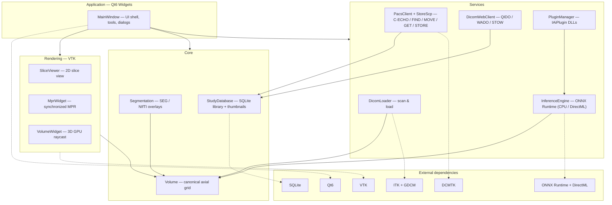

# Scanthia

A source-available, native Windows DICOM viewer built for speed, modern
UX, and AI-native extensibility.

**Status: early development — not for diagnostic use.**

## Features

- **2D slice viewing** — window/level (left-drag), zoom (right-drag), pan
  (middle-drag), slice scroll (wheel), cine playback, distance measurements,
  window presets (lung, bone, brain, …)
- **MPR** — synchronized axial / sagittal / coronal views with crosshairs
- **3D volume rendering** — GPU raycasting with CT presets (soft tissue, bone,
  lung, MIP) and MPR plane indicators
- **PACS networking** — C-ECHO, study-root C-FIND, C-MOVE and C-GET
  retrieval, plus a built-in C-STORE SCP to receive pushes
- **Segmentation** — DICOM SEG and NIfTI/NRRD labelmap overlays
- **AI-ready** — ONNX Runtime inference engine plus a Qt plugin API
  (`IAiPlugin`) so models ship as loadable plugins; a threshold-segmenter
  example plugin is bundled

## Architecture



```
src/core    data model (Volume, SeriesMeta)
src/io      DICOM scanning + series loading (GDCM via ITK, canonical LPS reorientation)
src/render  VTK/Qt views (SliceViewer, MprWidget, VolumeWidget)
src/pacs    DICOM networking (DCMTK): query/retrieve + store SCP
src/seg     DICOM SEG / labelmap -> overlay pipeline
src/ai      ONNX Runtime inference engine + plugin interface
plugins/    bundled IAiPlugin implementations
```

Volumes are reoriented to canonical axial (identity direction) at load time,
so index space == display space — this keeps MPR, crosshair and measurement
math simple and correct.

## Building (Windows / MSYS2 UCRT64)

```sh
pacman -S --needed mingw-w64-ucrt-x86_64-toolchain \
    mingw-w64-ucrt-x86_64-cmake mingw-w64-ucrt-x86_64-ninja \
    mingw-w64-ucrt-x86_64-qt6-base mingw-w64-ucrt-x86_64-qt6-tools \
    mingw-w64-ucrt-x86_64-vtk mingw-w64-ucrt-x86_64-itk \
    mingw-w64-ucrt-x86_64-dcmtk mingw-w64-ucrt-x86_64-gdcm \
    mingw-w64-ucrt-x86_64-onnxruntime \
    mingw-w64-ucrt-x86_64-eigen3 mingw-w64-ucrt-x86_64-nlohmann-json \
    mingw-w64-ucrt-x86_64-pugixml mingw-w64-ucrt-x86_64-exprtk \
    mingw-w64-ucrt-x86_64-verdict mingw-w64-ucrt-x86_64-gl2ps \
    mingw-w64-ucrt-x86_64-utf8cpp mingw-w64-ucrt-x86_64-cgns

export PATH=/ucrt64/bin:$PATH
cmake -B build -G Ninja -DCMAKE_BUILD_TYPE=Release
cmake --build build
./build/src/app/Scanthia.exe
```

Tests / pipeline probe:

```sh
python -m pip install pydicom numpy
python tests/gen_test_data.py            # synthetic CT series
./build/tests/meda_tests.exe             # unit tests
./build/tests/meda_probe.exe tests/data/ct_series out.png   # E2E: scan->load->render
```

The CMake files are toolchain-agnostic; MSVC + vcpkg works too.

## AI plugins

Implement `meda::IAiPlugin` (see `src/ai/AiPlugin.h`), build as a Qt plugin
and drop the DLL into `<bindir>/plugins/`. See `plugins/ThresholdSegPlugin.cpp`
for a working example. ONNX models can also be loaded directly via
*AI → Load ONNX Model* (2D NCHW per-slice or 3D NCDHW whole-volume models).

## Roadmap

See [docs/ROADMAP.md](docs/ROADMAP.md) for the competitive analysis vs
Horos/OsiriX and the phased plan to beat them.

## License

PolyForm Noncommercial 1.0.0 — see [LICENSE](LICENSE). Free for
personal, research, educational, and non-profit use. Commercial use
requires a separate license — open an issue to discuss.

## Disclaimer

Scanthia is a research/engineering project. It has **not** been cleared or
certified by any regulatory body (FDA, CE, etc.) and must not be used for
clinical diagnosis.
