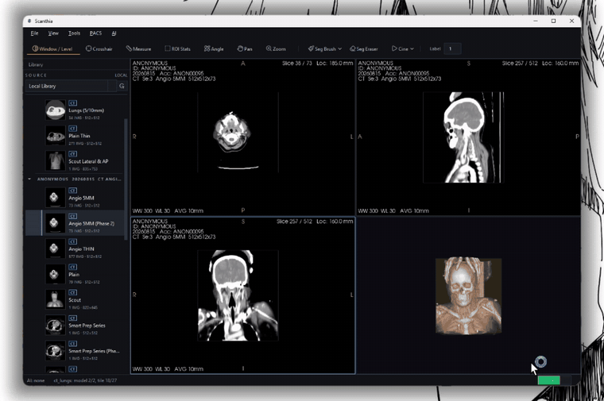
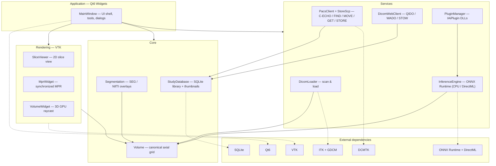

<p align="center">
  
</p>

<h1 align="center">Scanthia</h1>

<p align="center">
  <strong>A native Windows DICOM viewer — fast 2D/MPR/3D visualization,<br>
  PACS + DICOMweb connectivity, AI-assisted segmentation, and fusion.</strong>
</p>

<p align="center">
  <a href="https://github.com/8890aman/scanthia/actions/workflows/build.yml"></a>
  <a href="LICENSE"></a>
  <a href="https://github.com/8890aman/scanthia/releases/latest"></a>
  
  
  
</p>

<p align="center">
  Built with Qt6 · VTK · ITK · DCMTK · GDCM · ONNX Runtime + DirectML
</p>

> [!CAUTION]
> **Research/engineering project — not a certified medical device.** Scanthia
> has not been cleared by the FDA, CE, or any regulatory body and must not be
> used for clinical diagnosis. See [DISCLAIMER.txt](DISCLAIMER.txt).

## Demo



*[Full 4-minute walkthrough](docs/scanthia-demo.mp4): library, MPR + 3D,
PACS query/retrieve with Orthanc, segmentation, and export.*

## Features

**Viewing**

- 2D slice viewing — window/level (left-drag), zoom (right-drag), pan
  (middle-drag), slice scroll, cine playback, multi-frame support, invert
  grayscale, distance measurements, window presets (lung, bone, brain, …)
- MPR — synchronized axial / sagittal / coronal views with crosshairs,
  oblique plane rotation, double-click maximize/restore
- 3D — GPU volume raycasting with CT presets (soft tissue, bone, lung, MIP)
  and MPR plane indicators
- Fusion — PET/CT-style overlay with resampling onto the base grid and
  opacity control

**Connectivity**

- PACS — C-ECHO, study-root C-FIND, C-MOVE and C-GET retrieval, a built-in
  C-STORE SCP to receive pushes, saved node management, scheduled auto-pull,
  and send-to-node
- DICOMweb — QIDO / WADO / STOW client
- `scanthia://` URL protocol for deep links

**Data**

- Local library — SQLite study index with thumbnails and remote-source
  switching
- Incremental loading — studies are browsable while still streaming in, with
  generation-based cancellation on series switch
- Memory-safe downsampling for studies that exceed the volume budget
- Segmentation — DICOM SEG and NIfTI/NRRD labelmap overlays, brush tools
- Export — JPEG, MP4 video, PDF/print, anonymized (de-identified) DICOM,
  DICOM media/CD

**Extensibility**

- AI inference — ONNX Runtime engine, CPU and DirectML GPU providers;
  2D NCHW per-slice or 3D NCDHW whole-volume models
- Plugin API — `IAiPlugin` Qt plugins loaded from `<bindir>/plugins/`;
  a threshold-segmenter example ships in `plugins/`
- Remappable shortcut plumbing, touch gestures, i18n scaffolding

## Architecture



```
src/app     Qt6 application shell (MainWindow, theme, icons)
src/core    data model (Volume, SeriesMeta)
src/io      DICOM scanning + series loading (GDCM via ITK, canonical reorientation)
src/render  VTK/Qt views (SliceViewer, MprWidget, VolumeWidget)
src/db      local study library (SQLite, thumbnails)
src/pacs    DICOM networking (DCMTK), DICOMweb, nodes, anonymizer, export
src/seg     DICOM SEG / labelmap -> overlay pipeline
src/ai      ONNX Runtime inference engine + plugin interface
plugins/    bundled IAiPlugin implementations
```

Volumes are reoriented to canonical axial (identity direction) at load time,
so index space == display space — this keeps MPR, crosshair and measurement
math simple and correct.

## Download

Grab the Windows installer from
[**Releases → Scanthia-Setup.exe**](https://github.com/8890aman/scanthia/releases/latest).
Installs to `Program Files`, requires admin.

## Building (Windows / MSYS2 UCRT64)

```sh
pacman -S --needed mingw-w64-ucrt-x86_64-toolchain \
    mingw-w64-ucrt-x86_64-cmake mingw-w64-ucrt-x86_64-ninja \
    mingw-w64-ucrt-x86_64-qt6-base mingw-w64-ucrt-x86_64-qt6-tools \
    mingw-w64-ucrt-x86_64-vtk mingw-w64-ucrt-x86_64-itk \
    mingw-w64-ucrt-x86_64-dcmtk mingw-w64-ucrt-x86_64-gdcm \
    mingw-w64-ucrt-x86_64-onnxruntime \
    mingw-w64-ucrt-x86_64-eigen3 mingw-w64-ucrt-x86_64-nlohmann-json \
    mingw-w64-ucrt-x86_64-pugixml mingw-w64-ucrt-x86_64-exprtk \
    mingw-w64-ucrt-x86_64-verdict mingw-w64-ucrt-x86_64-gl2ps \
    mingw-w64-ucrt-x86_64-utf8cpp mingw-w64-ucrt-x86_64-cgns

export PATH=/ucrt64/bin:$PATH
cmake -B build -G Ninja -DCMAKE_BUILD_TYPE=Release
cmake --build build
./build/src/app/Scanthia.exe
```

Tests / pipeline probe:

```sh
python -m pip install pydicom numpy
python tests/gen_test_data.py            # synthetic CT series
./build/tests/meda_tests.exe             # unit tests
./build/tests/meda_probe.exe tests/data/ct_series out.png   # E2E: scan->load->render
```

The CMake files are toolchain-agnostic; MSVC + vcpkg works too.

## AI plugins

Implement `meda::IAiPlugin` (see `src/ai/AiPlugin.h`), build as a Qt plugin
and drop the DLL into `<bindir>/plugins/`. See `plugins/ThresholdSegPlugin.cpp`
for a working example. ONNX models can also be loaded directly via
*AI → Load ONNX Model* (2D NCHW per-slice or 3D NCDHW whole-volume models).

## Documentation

- [docs/ROADMAP.md](docs/ROADMAP.md) — competitive analysis vs Horos/OsiriX
  and the phased plan
- [docs/TRACKER.md](docs/TRACKER.md) — feature parity tracker
- [DESIGN.md](DESIGN.md) — design language and UI principles
- [PRODUCT.md](PRODUCT.md) — product definition and constraints
- [CONTRIBUTING.md](CONTRIBUTING.md) — how to contribute
- [AGENTS.md](AGENTS.md) — build/verify notes for AI coding agents

## License

[PolyForm Noncommercial 1.0.0](LICENSE) — free for personal, research,
educational, and non-profit use. Commercial use requires a separate
license; open an issue to discuss.

## Disclaimer

Scanthia is a research/engineering project. It has **not** been cleared or
certified by any regulatory body (FDA, CE, etc.) and must not be used for
clinical diagnosis.
